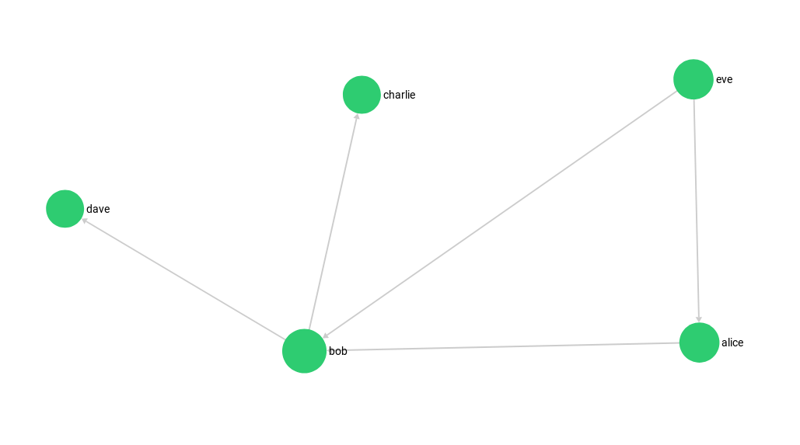
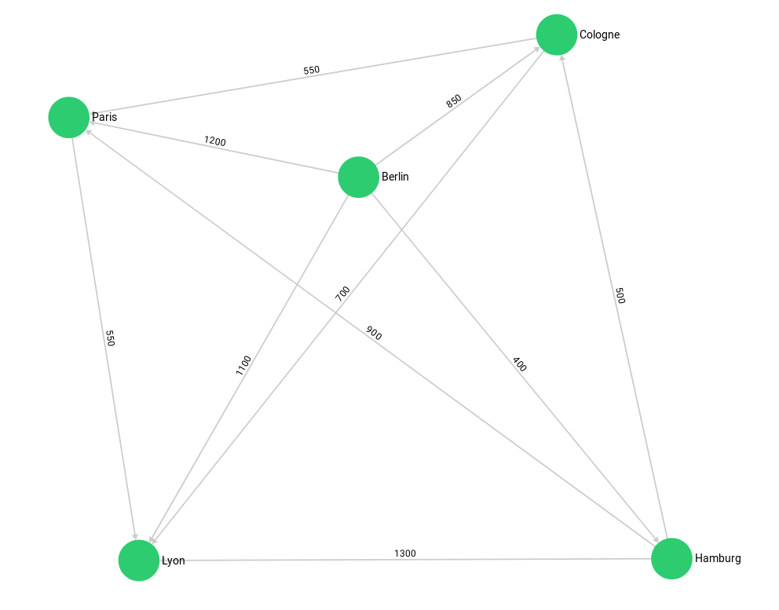

Remove Vertex
=============

Deleting vertices with associated edges is currently not handled via AQL while the [graph management interface](../../Manual/Graphs/GeneralGraphs/Management.html#remove-a-vertex) and the [REST API for the graph module](../../HTTP/Gharial/Vertices.html#remove-a-vertex) offer a vertex deletion functionality.
However, as shown in this example based on the [knows_graph](../../Manual/Graphs/index.html#the-knowsgraph), a query for this use case can be created.

When deleting vertex **eve** from the graph, we also want the edges `eve -> alice` and `eve -> bob` to be removed.
The involved graph and edge collections have to be known. In this case it is the graph **knows_graph** and the edge collection **knows**.

This query is deleting **eve** with its adjacent edges:

    @startDocuBlockInline GRAPHTRAV_removeVertex1
    @EXAMPLE_AQL{GRAPHTRAV_removeVertex1}
    @DATASET{knows_graph}
LET keys = (FOR v, e IN 1..1 ANY 'persons/eve' GRAPH 'knows_graph' RETURN e._key)
LET r = (FOR key IN keys REMOVE key IN knows) 
REMOVE 'eve' IN persons
    @END_EXAMPLE_AQL
    @endDocuBlock GRAPHTRAV_removeVertex1

At first a graph traversal of depth 1 is used to get the `_key` of **eve's** adjacent edges.
Then all of these edges are removed from the `knows` collection and after that the vertex **eve** is removed itself.

The following query shows a different design to achieve the same result:

    @startDocuBlockInline GRAPHTRAV_removeVertex2
    @EXAMPLE_AQL{GRAPHTRAV_removeVertex2}
    @DATASET{knows_graph}
LET keys = (FOR v, e IN 1..1 ANY 'persons/eve' GRAPH 'knows_graph'
            REMOVE e._key IN knows)
REMOVE 'eve' IN persons
    @END_EXAMPLE_AQL
    @endDocuBlock GRAPHTRAV_removeVertex2

**Note**: The query has to be adjusted to match a graph with multiple vertex/edge collections.

For example, the [city graph](../../Manual/Graphs/index.html#the-city-graph) contains several vertex collections - `germanCity and frenchCity` and several edge collections -  `french / german / international Highway`.

To delete city **Berlin** both edge collections "germanHighway" and "internationalHighway" have to be considered. The **REMOVE** operation has to be applied on both collections with `OPTIONS { ignoreErrors: true }`. Otherwise the query would stop once a key in a collection, where it does not exist, should be removed.

    @startDocuBlockInline GRAPHTRAV_removeVertex3
    @EXAMPLE_AQL{GRAPHTRAV_removeVertex3}
    @DATASET{routeplanner}
LET keys = (FOR v, e IN 1..1 ANY 'germanCity/Berlin' GRAPH 'routeplanner' RETURN e._key)
LET r = (FOR key IN keys REMOVE key IN internationalHighway    
        OPTIONS { ignoreErrors: true } REMOVE key IN germanHighway
        OPTIONS { ignoreErrors: true }) 
REMOVE 'Berlin' IN germanCity
    @END_EXAMPLE_AQL
    @endDocuBlock GRAPHTRAV_removeVertex3
